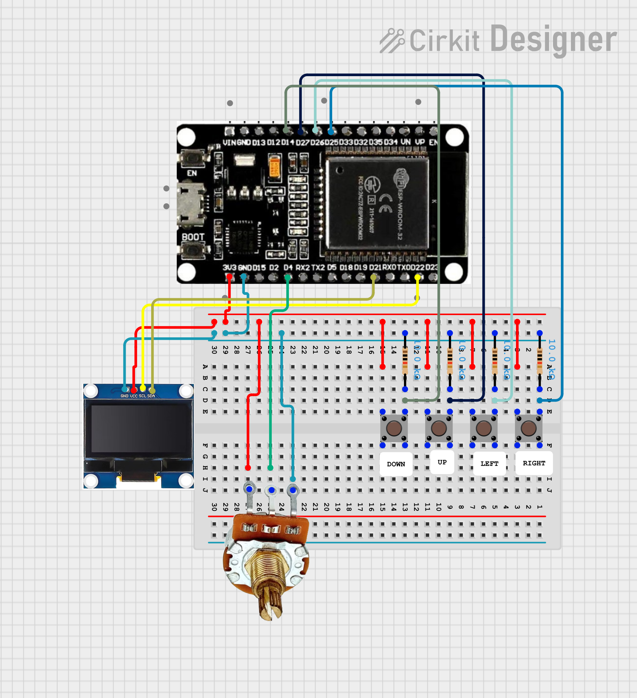

# #13 ESP32 Mini Paint

This project is an interactive drawing tool that turns an ESP32 and an OLED display into a digital canvas. It allows the user to navigate a cursor, draw shapes with adjustable thickness, and manage the canvas area using physical controls.

## Features

- **Free-hand Drawing:** Precise pixel-by-pixel navigation using a 4-button directional pad.
- **Dynamic Brush Size:** Real-time adjustment of the brush diameter using a **Potentiometer** connected to an Analog-to-Digital Converter (ADC).
- **Canvas Management:** A "Master Clear" function triggered by a specific button combination to reset the drawing area.

## How it Works

1. **Navigation:** The user moves the cursor across the 128x64 coordinate system using the `UP`, `DOWN`, `LEFT`, and `RIGHT` buttons.
2. **Brush Control:** The device reads the analog voltage from the potentiometer on `POT_PIN`. The raw 12-bit value (0-4095) is mapped to a brush radius:
   $$dotSize = \frac{AnalogRead(GPIO 4)}{210}$$
3. **Drawing:** In every loop iteration, the device draws a filled circle at the current coordinates. Since the display is not cleared by default, the cursor leaves a permanent trail, creating a drawing.
4. **Hard Reset:** If all four directional buttons are pressed simultaneously, the `display.clearDisplay()` function is triggered, wiping the canvas clean.

## Circuit image

## Hardware Requirements

- **ESP32** DevKit V1
- **SSD1306** OLED Display (128x64) via $I^2C$
- **4x Tactile Push Buttons** (Directional Pad)
- **1x 10k Ohm Potentiometer** (Connected to GPIO 4)

## Configuration

The project utilizes the following hardware pinout:

- **Horizontal Controls:** GPIO 26 (Left), GPIO 25 (Right)
- **Vertical Controls:** GPIO 27 (Top), GPIO 14 (Bottom)
- **Analog Input:** GPIO 4 (Potentiometer)
- **I2C Interface:** Standard ESP32 pins (SDA: 21, SCL: 22)
