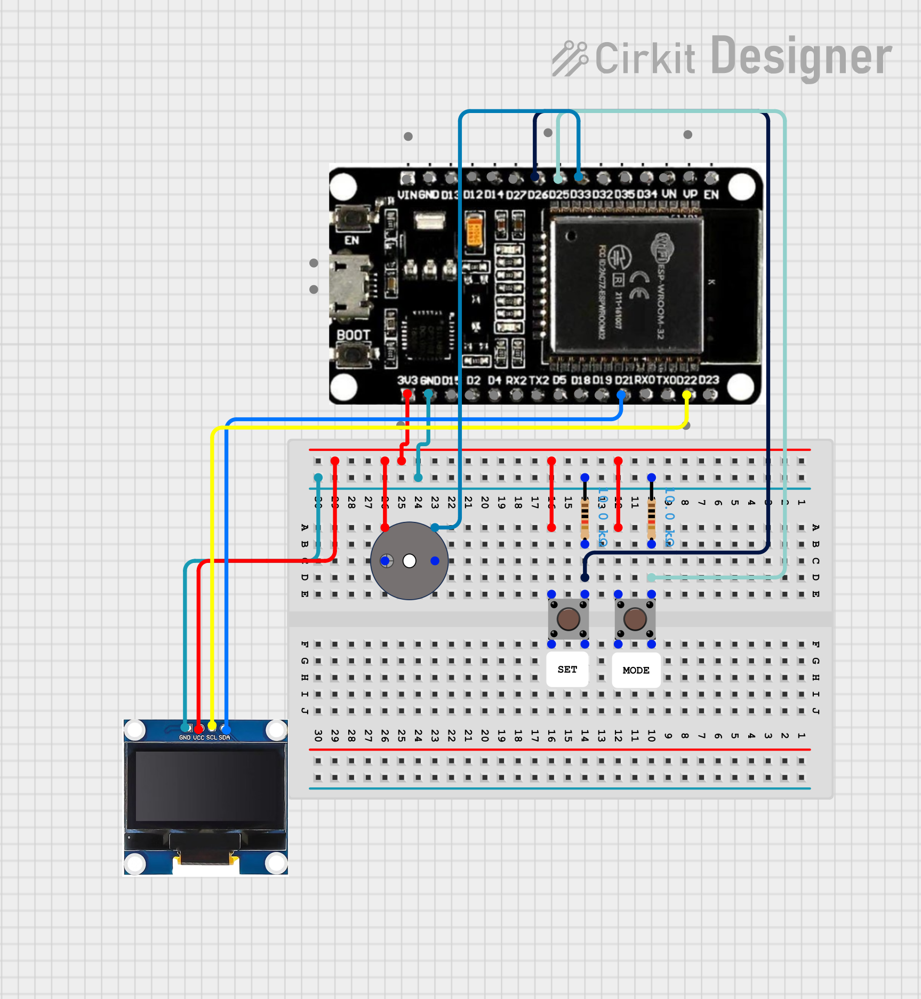

# #14 ESP32 OLED Alarm Clock

A simple **digital clock with alarm function** built using an ESP32 and a 128x64 OLED display. The project uses 2 push buttons for control and an active buzzer for audio alerts.

## Features

- Displays time in **HH:MM:SS** format
- Set current hours and minutes
- Configure alarm time
- Enable / disable alarm
- Blinking digits while editing
- Audible alarm signal

## Operating Modes

The **MODE** button cycles through 5 modes:

0 – Normal time display  
1 – Set hours  
2 – Set minutes  
3 – Set alarm hours  
4 – Set alarm minutes

The **SET** button modifies values in the selected mode.  
In mode 0, it toggles the alarm ON/OFF or stops the ringing alarm.

## How It Works

- Time is tracked in software using `millis()` (updated every 1 second).
- When current time matches the alarm time, the buzzer activates.
- The buzzer toggles every 500 ms to create a blinking sound effect.
- A bell icon appears on the display when the alarm is enabled.

## Circuit image

## Hardware Requirements

- ESP32 DevKit V1
- SSD1306 128x64 OLED display (I2C)
- 2x tactile push buttons
- Active buzzer

## Pin Configuration

- BTN_SET → GPIO 26
- BTN_MODE → GPIO 25
- BUZZER → GPIO 33
- SDA → GPIO 21
- SCL → GPIO 22
