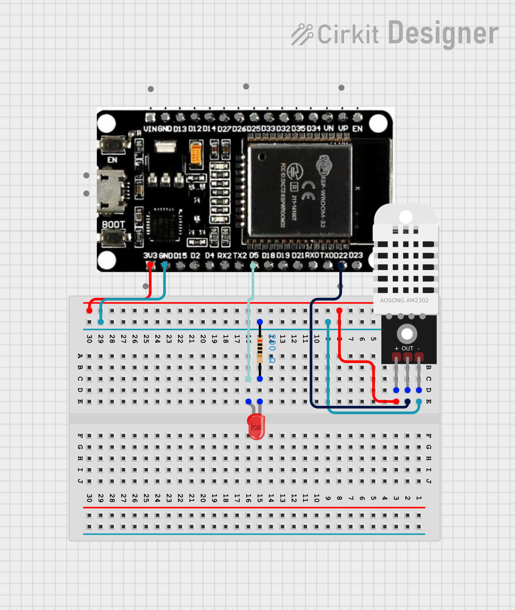
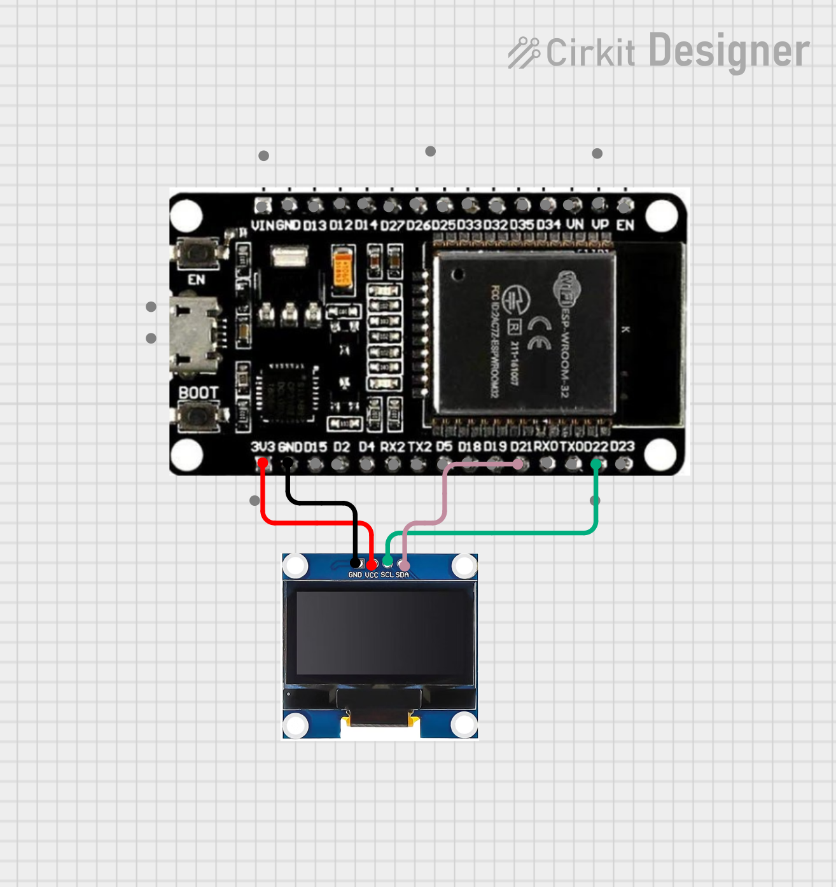

# #15 ESP32 BLE Weather Station (Broadcaster & Receiver)

A wireless **temperature and humidity monitoring system** based on two ESP32 modules. The project utilizes BLE (Bluetooth Low Energy) Advertising to broadcast sensor data without establishing a formal connection.

## Features

- **Connectionless Communication**: Data is broadcasted via Advertising packets (Beacon mode).
- **Binary Data Efficiency**: Uses a custom C-struct to pack data into a minimal byte array.
- **Real-time OLED Monitoring**: Receiver displays live data on a 128x64 screen.
- **Status Indicators**: Visual LED feedback on the transmitter during updates.
- **Error Handling**: Detects sensor failures and broadcasts error codes (-999).

## How It Works

1. **Transmitter (Broadcaster)**:
   - Reads temperature and humidity from the **DHT22** sensor.
   - Converts floats to 16-bit integers (multiplied by 100) to maintain 2-decimal precision while saving space.
   - Updates the **Manufacturer Specific Data** field in the BLE packet.
   - Re-starts advertising every 5 seconds.

2. **Receiver (Scanner)**:
   - Scans the BLE environment for a device named **"DHT_DATA"**.
   - Extracts raw bytes from the `ManufacturerData` field.
   - Uses `memcpy` to map bytes back into a `SensorData` struct.
   - Displays the decoded values on the **SSD1306 OLED** display.

## Circuit image

### Transmiter

### Receiver

## Hardware Requirements

### Transmitter

- ESP32 DevKit V1
- DHT22 (AM2302) Sensor
- 1x LED (Status)
- 1x 220Ω Resistor

### Receiver

- ESP32 DevKit V1
- SSD1306 128x64 OLED Display (I2C)

## Pin Configuration

### Transmitter (DHT_DATA)

- **DHT22 Data**: GPIO 22
- **Status LED**: GPIO 5

### Receiver (Display Unit)

- **SDA (OLED)**: GPIO 21
- **SCL (OLED)**: GPIO 22

## Data Protocol

To ensure compatibility between the broadcaster and receiver, both use the same memory alignment:

| Field | Type    | Scale | Description                        |
| ----- | ------- | ----- | ---------------------------------- |
| temp  | int16_t | x100  | Temperature (e.g., 25.50C -> 2550) |
| hum   | int16_t | x100  | Humidity (e.g., 40.20% -> 4020)    |

## Software Dependencies

- `DHT sensor library` (Adafruit)
- `Adafruit SSD1306` & `Adafruit GFX`
- `ESP32 BLE Arduino` (Built-in)
