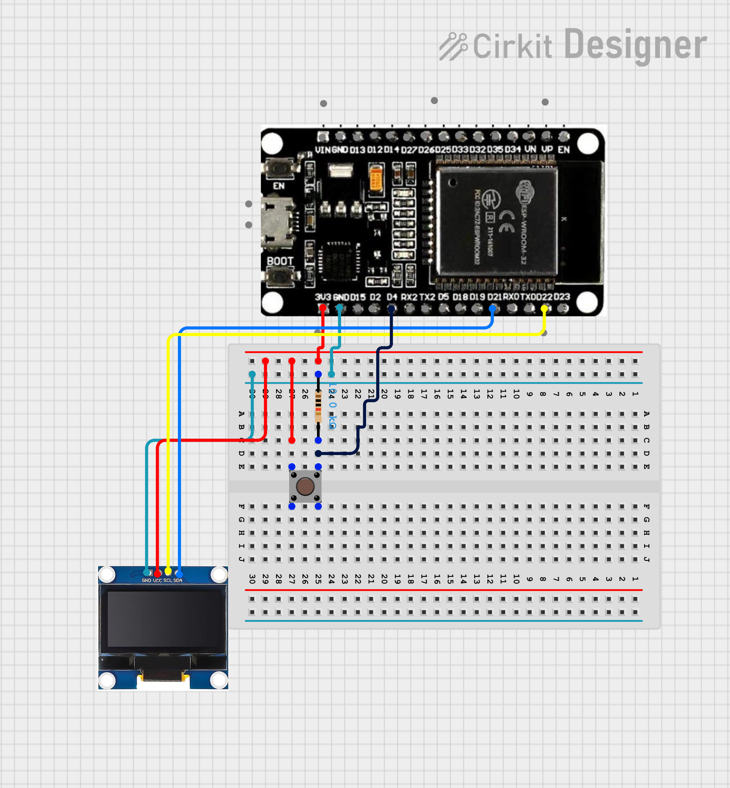

# #17 ESP32 BLE Multi-User Chat

A **multi-user wireless chat system** built with ESP32 that allows multiple smartphones to communicate through a central hub. Messages are displayed on a 128x64 OLED screen with an automatic scrolling feature and re-broadcasted to all connected participants.

## Features

- **Multi-user Support**: Simultaneous connections with continuous BLE Advertising.
- **Dynamic Display**: Real-time message rendering on **SSD1306 OLED**.
- **Smart Wrapping**: Automatic text wrapping for messages longer than 21 characters.
- **Memory Optimized**: Uses a static circular buffer and `uint8_t` types to prevent RAM fragmentation.
- **Sender ID**: Identifies users by the last 5 characters of their unique MAC address.
- **Hardware Reset**: Dedicated physical button to wipe chat history instantly.

## How It Works

- **BLE Stack**: The ESP32 operates as a BLE Server. It uses a custom `onWrite` callback that captures the `esp_ble_gatts_cb_param_t` to extract the sender's BDA (Bluetooth Device Address).
- **Message Flow**:
  1. Phone sends a string to the **RX Characteristic**.
  2. ESP32 formats the message: `[ShortID]: Message`.
  3. The message is pushed into a `char[8][22]` circular buffer.
  4. ESP32 triggers a `Notify` on the **TX Characteristic** to sync all connected phones.

## nRF Connect Usage

To use this project with the **nRF Connect for Mobile** app:

1. **Scan & Connect**: Find and connect to `ESP32_Multi_Chat`.
2. **Enable Listen**: Click the **Download/Triple Arrow** icon on the **TX Characteristic** (`...0003`) to see messages from other users.
3. **Send Message**: Click the **Upload/Up Arrow** icon on the **RX Characteristic** (`...0002`), select "TEXT", type your message, and send.

## Circuit image

## Hardware Requirements

- **ESP32 DevKit V1**
- **SSD1306 128x64 OLED** (I2C)
- **1x Push Button** (Reset)
- **1x 10kΩ Resistor** (Pull-down)

## Pin Configuration

| Component     | ESP32 Pin |
| :------------ | :-------- |
| **RESET_BTN** | GPIO 4    |
| **OLED SDA**  | GPIO 21   |
| **OLED SCL**  | GPIO 22   |
| **OLED VCC**  | 3.3V      |
| **OLED GND**  | GND       |

---
