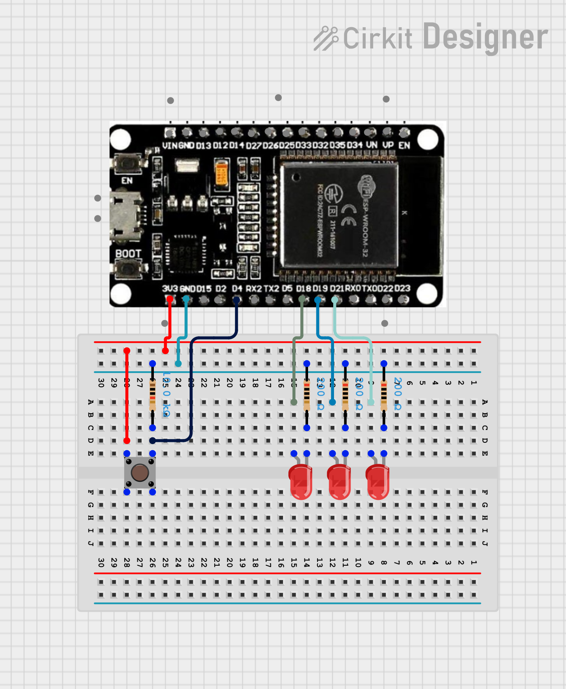

# #XX ESP32 FreeRTOS 3-Bit Binary Counter

A simple **3-bit binary counter** built on ESP32 using FreeRTOS.  
The system uses a **counting semaphore as a counter**, where each button press increases the value and the counter automatically decreases over time. The current value is displayed in binary using three LEDs.

## Features

- 3-bit binary output (range 0–7)
- Counting semaphore used as a shared counter
- Automatic decrement every second
- Separate FreeRTOS tasks for input, logic, and display
- Simple software debounce
- Lightweight and memory-efficient design

## How It Works

The application uses a **counting semaphore** with:

- **Maximum value:** 7
- **Initial value:** 0

The semaphore acts as the system counter.

### Counter Behavior

- Each button press increases the counter (up to 7).
- Every second, the counter decreases by 1 (if greater than 0).
- LEDs continuously reflect the current counter value in binary form.

## Task Architecture

The system runs three independent FreeRTOS tasks:

### LED Task

- Reads the current semaphore count.
- Displays the value in binary using three LEDs.
- Refreshes every 20 ms.

### Button Task

- Monitors the push button.
- Increments the counter when pressed.
- Includes a short delay to reduce bounce effects.

### Decay Task

- Checks if the counter is greater than zero.
- Waits one second.
- Decrements the counter by taking from the semaphore.

## Circuit image

## Hardware Requirements

- ESP32 DevKit V1
- 3× LEDs
- 3× current-limiting resistors
- 1× push button
- Pull-up or pull-down resistor (if not using internal pull-up)

## Pin Configuration

| Component | ESP32 Pin |
| --------- | --------- |
| BTN       | GPIO 4    |
| LED_0     | GPIO 21   |
| LED_1     | GPIO 19   |
| LED_2     | GPIO 18   |
