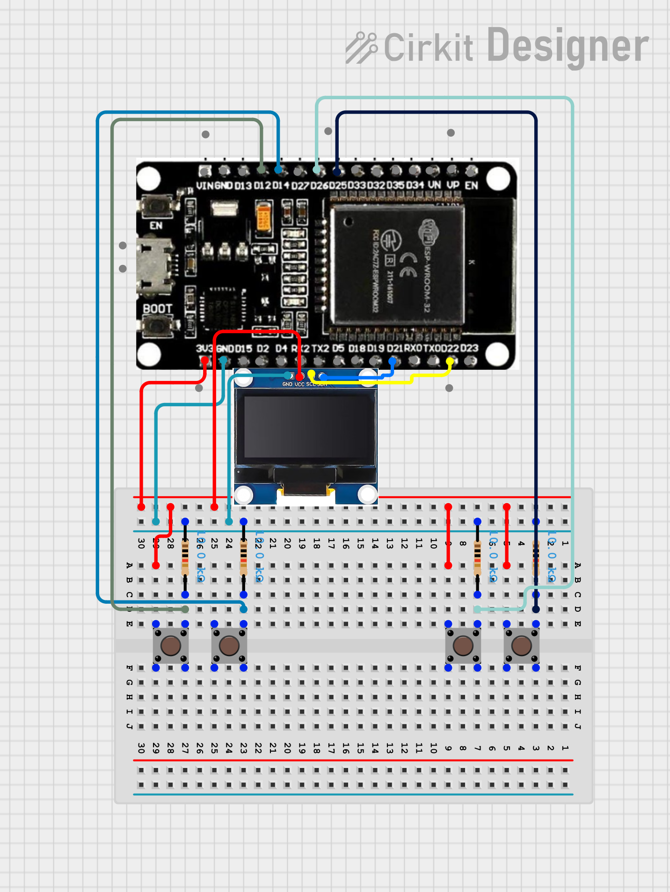

# #20 Ping Pong

A two-player **Pong game** built on ESP32 using FreeRTOS, displayed on a 128×64 OLED screen.  
The system uses **three independent FreeRTOS tasks** for input handling, physics simulation, and rendering, running concurrently for smooth gameplay.

## Features

- Two-player local multiplayer
- Real-time ball physics with angle variation on paddle hit
- Automatic game reset when a player scores
- Separate FreeRTOS tasks for input, physics, and rendering
- Tunnel-safe collision detection
- Lightweight and memory-efficient design

## How It Works

Each player controls a paddle using two buttons (up/down). A ball bounces between the paddles — the angle of the return depends on where the ball hits the paddle. If the ball passes either side of the screen, the game resets automatically.

### Ball Behavior

- Starts at the center of the screen moving horizontally.
- Bounces off the top and bottom walls.
- Reflects off paddles with vertical angle variation based on hit position:
  - Center hit → straight return (dy ≈ 0)
  - Top hit → angled upward (dy < 0)
  - Bottom hit → angled downward (dy > 0)
- If the ball exits left or right, `startGame()` resets all positions.

## Task Architecture

The system runs three independent FreeRTOS tasks:

### Input Task (20 ms tick)

- Reads all four player buttons.
- Moves the corresponding paddle up or down.
- Acts as a simple software debounce via task delay.

### Physics Task (100 ms tick)

- Updates ball position by `dx` and `dy` each tick.
- Calls the appropriate collision check based on ball direction.
- Bounces the ball off top/bottom walls.
- Resets the game if the ball exits the left or right boundary.

### Render Task (10 ms tick)

- Clears the display buffer.
- Draws both paddles and the ball.
- Pushes the buffer to the OLED display.

## Circuit Image

## Hardware Requirements

- ESP32 DevKit V1
- SSD1306 128×64 OLED display (I2C)
- 4× push buttons
- Pull-down resistors for buttons (if not using internal pull-ups)

## Pin Configuration

| Component    | ESP32 Pin             |
| ------------ | --------------------- |
| PLAYER1_UP   | GPIO 14               |
| PLAYER1_DOWN | GPIO 12               |
| PLAYER2_UP   | GPIO 25               |
| PLAYER2_DOWN | GPIO 26               |
| OLED SDA     | GPIO 21 (default I2C) |
| OLED SCL     | GPIO 22 (default I2C) |
