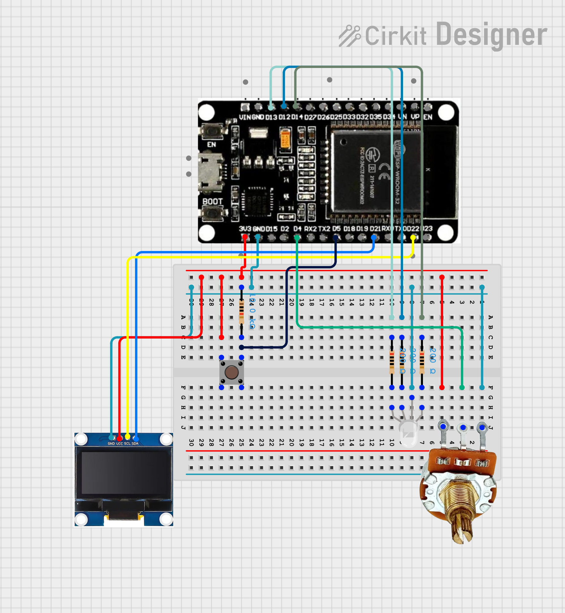

# RGB LED Controller (ESP32 + FreeRTOS)

Simple RGB LED controller using **ESP32**, **FreeRTOS**, a **potentiometer**, **push button**, and a **128×64 OLED display**.
The potentiometer controls brightness (0–255) of the selected color channel, while the button switches between **R → B → G**.

## Features

- RGB LED brightness control via PWM
- Channel selection using a push button
- Real-time values displayed on OLED
- Multitasking using FreeRTOS
- Lightweight embedded UI

## How It Works

The system has three color variables:

- `red_value`
- `blue_value`
- `green_value`

The **potentiometer** sets the value of the currently selected channel.
The **button** cycles between channels.

Example OLED display:

```
R: 120 <--
B: 40
G: 200
```

`<--` indicates the active channel.

## Task Architecture

The program runs **three FreeRTOS tasks**.

### Input Task (50 ms)

Handles user input.

- Reads button state
- Changes active channel (`mode`)
- Reads potentiometer
- Updates RGB value

### Render Task (20 ms)

Updates the OLED display.

- Clears the screen
- Prints RGB values
- Marks selected channel
- Sends buffer to display

### Output Task (50 ms)

Controls the RGB LED.

- Writes PWM values using `ledcWrite()`
- Updates LED brightness

## PWM Configuration

| Parameter  | Value   |
| ---------- | ------- |
| Frequency  | 5000 Hz |
| Resolution | 8-bit   |
| Range      | 0–255   |

PWM channels:

| Color | Channel |
| ----- | ------- |
| Red   | 0       |
| Blue  | 1       |
| Green | 2       |

## Circuit Image



## Hardware Requirements

Required components:

- ESP32 DevKit
- SSD1306 OLED (128×64, I2C)
- RGB LED
- Potentiometer
- Push button

## Pin Configuration

| Component     | ESP32 Pin |
| ------------- | --------- |
| Button        | GPIO 5    |
| Potentiometer | GPIO 4    |
| Red LED       | GPIO 13   |
| Blue LED      | GPIO 14   |
| Green LED     | GPIO 12   |
| OLED SDA      | GPIO 21   |
| OLED SCL      | GPIO 22   |
