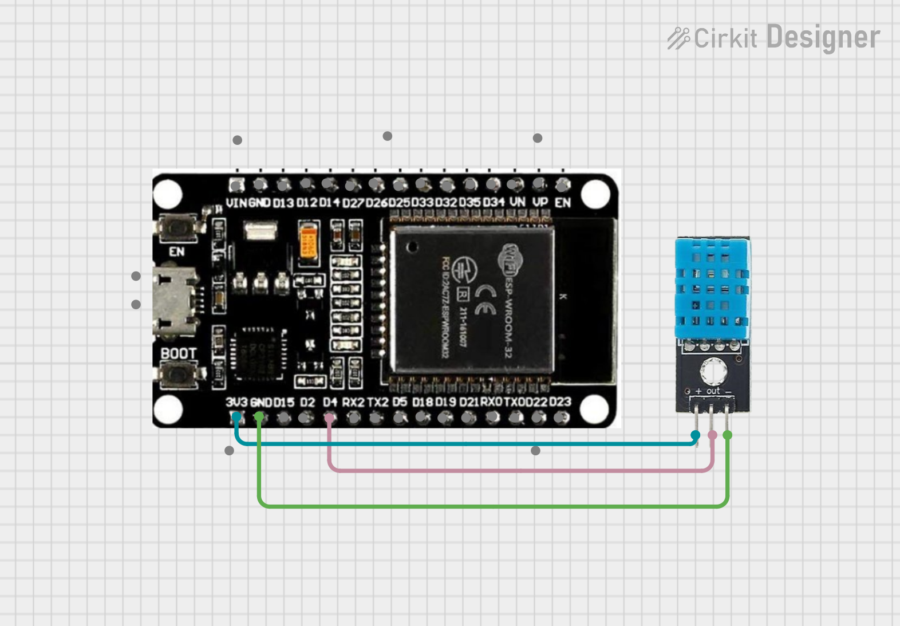
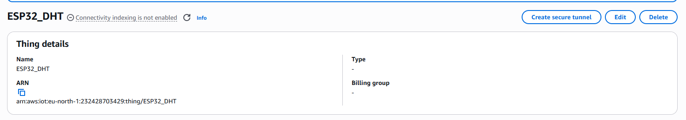
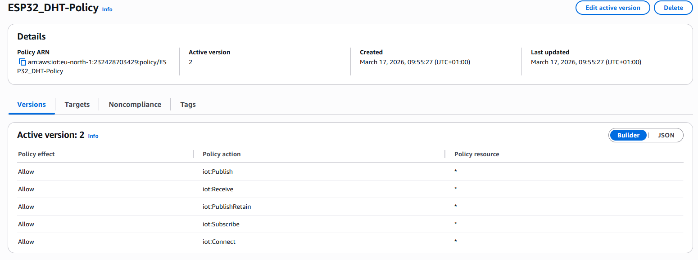
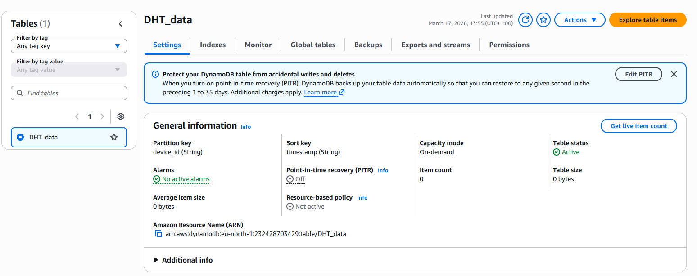
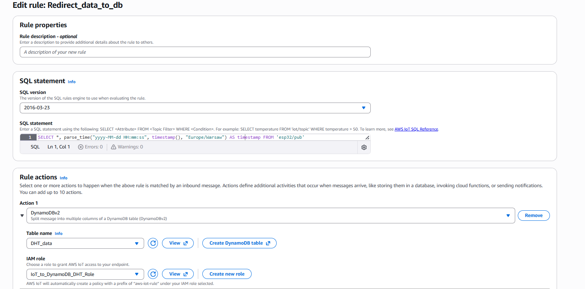

# #23 ESP32 Cloud-Connected Climate Monitor

A streamlined IoT project that reads temperature and humidity data from a **DHT22** sensor and transmits it to **AWS Cloud** via the **MQTT** protocol. The data is processed and stored in a **DynamoDB** database for long-term logging and analysis.

## Features

- **Environmental Sensing**: Real-time monitoring using the DHT22 sensor.
- **Secure Communication**: Fully encrypted MQTT connection (Port 8883) using TLS certificates.
- **Automated Cloud Logging**: Integration with AWS IoT Core and DynamoDB for persistent storage.
- **Cloud-Side Processing**: SQL-based data transformation and localized timestamping within AWS.

## System Architecture

1. **ESP32**: Reads sensor data and publishes it as a JSON payload to the cloud.
2. **AWS IoT Core**: Authenticates the device and acts as the message broker.
3. **AWS IoT Rule**: Uses SQL to extract data and add a server-side timestamp.
4. **Amazon DynamoDB**: Stores the data in a structured, multi-column format.

## Circuit Image



## Hardware Configuration

| Component      | ESP32 Pin |
| :------------- | :-------- |
| **DHT22 DATA** | GPIO 4    |
| **VCC**        | 3.3V      |
| **GND**        | GND       |

## Software Requirements

### PlatformIO Dependencies

Add these to your `platformio.ini`:

```ini
lib_deps =
	adafruit/Adafruit Unified Sensor@^1.1.15
	adafruit/DHT sensor library@^1.4.6
	knolleary/PubSubClient@^2.8
	bblanchon/ArduinoJson@^7.2.2
```

## AWS Configuration Steps

To ensure the system functions correctly, the AWS backend must be configured as follows:

### 1. Provisioning the "Thing" and "Policy"

Create a "Thing" in **AWS IoT Core**. Generate and download the certificates (Device Certificate, Private Key, and Root CA). These must be stored in the `secrets.h` file. Also add or change policies in Seciurity-> Policies.



### 2. DynamoDB Table Setup

Create a table named `DHT_data`.

- **Partition Key**: `device_id` (Type: String)
- **Sort Key**: `timestamp` (Type: String or Number)



### 3. IoT Rule Configuration

Set up a rule to route messages from the `esp32/pub` topic.

**SQL Statement**:

```sql
SELECT *, parse_time("yyyy-MM-dd HH:mm:ss", timestamp(), "Europe/Warsaw") AS timestamp FROM 'esp32/pub'
```



## Data Schema

The ESP32 sends the following JSON structure:

```json
{
  "humidity": 48.5,
  "temperature": 22.5,
  "device_id": "DHT22_01"
}
```
