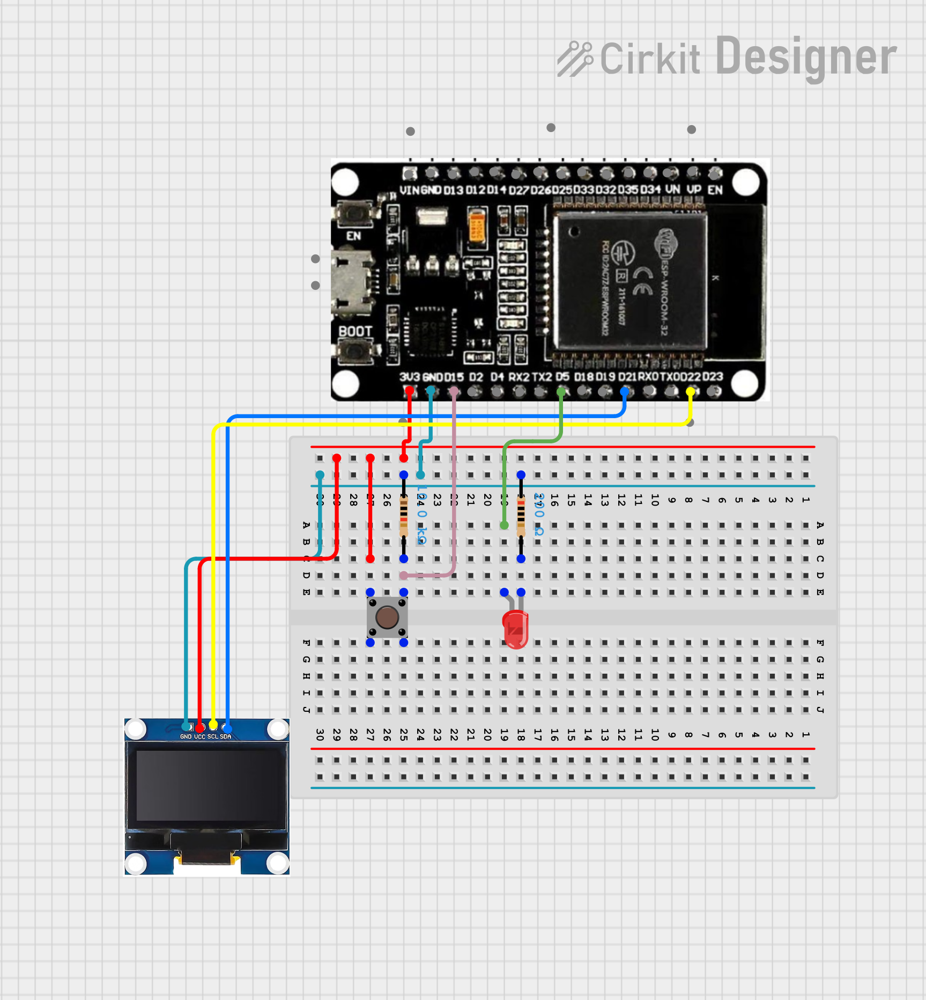

# #24 Simon Says

Simple rhythm-based memory game using **ESP32**, a **push button**, an **LED**, and a **128×64 OLED display**.
The device plays a random light pattern, and the player must reproduce it by pressing the button in the same rhythm. The accuracy of the reproduction is displayed at the end.

## Features

- Random LED pattern generation
- Player input capture with interrupt-driven button handling
- Accuracy scoring based on timing difference
- Real-time countdown displayed on OLED
- Debounced ISR with critical section protection
- State machine architecture

## How It Works

The game runs through four phases:

1. **Show Pattern** — the LED blinks a sequence of random intervals (1000–5000 ms)
2. **Countdown** — a 3-second countdown is displayed on the OLED
3. **User Input** — the player reproduces the rhythm by pressing the button
4. **Result** — accuracy is calculated and displayed; press the button to play again

Example OLED display after the game:

```
Accuracy: 87.3 %
1843 vs 1902
3210 vs 3105
2780 vs 2634
```

## State Machine

The program is built around four states defined as an `enum class`:

```
SHOW_PATTERN → COUNTDOWN → USER_INPUT → RESULT → (restart)
```

| State        | Description                                 |
| ------------ | ------------------------------------------- |
| SHOW_PATTERN | LED blinks the pattern the player must copy |
| COUNTDOWN    | 3-2-1-START displayed on screen             |
| USER_INPUT   | Button presses are captured and timed       |
| RESULT       | Accuracy score shown; button restarts game  |

## Accuracy Calculation

For each step `i`, the error is computed as:

```
delta = |pattern[i] - userPattern[i]|
error = delta / pattern[i]
accuracy_i = (1 - min(error, 1.0)) * 100%
```

The final score is the average across all steps. An error exceeding 100% is clamped to 0% accuracy for that step, preventing negative scores.

## Interrupt Handling

Button presses are handled via a hardware interrupt on `INPUT_PIN`. A 200 ms software debounce prevents multiple triggers per press. The `clicked` flag is protected by a FreeRTOS critical section (`portENTER_CRITICAL`) to safely share state between the ISR and the main loop.

```cpp
void IRAM_ATTR isr() {
  // debounce + critical section
}
```

The helper `consumeClick()` atomically reads and clears the `clicked` flag.

## Circuit Image



## Hardware Requirements

Required components:

- ESP32 DevKit
- SSD1306 OLED (128×64, I2C)
- Push button
- LED + resistor (220Ω recommended)

## Pin Configuration

| Component | ESP32 Pin |
| --------- | --------- |
| Button    | GPIO 15   |
| LED       | GPIO 5    |
| OLED SDA  | GPIO 21   |
| OLED SCL  | GPIO 22   |

## Configuration

All tuneable parameters are defined as macros at the top of the file:

| Macro           | Default | Description                        |
| --------------- | ------- | ---------------------------------- |
| `SCREEN_WIDTH`  | 128     | OLED width in pixels               |
| `SCREEN_HEIGHT` | 64      | OLED height in pixels              |
| `INPUT_PIN`     | 15      | GPIO pin for the button            |
| `LED_PIN`       | 5       | GPIO pin for the LED               |
| `PATTERN_SIZE`  | 10      | Maximum pattern length             |
| `LED_ON_MS`     | 200     | LED blink duration in milliseconds |
| `COUNTDOWN_SEC` | 3       | Countdown duration in seconds      |

## Code Structure

| Function              | Description                                      |
| --------------------- | ------------------------------------------------ |
| `isr()`               | Interrupt handler — debounce + sets `clicked`    |
| `consumeClick()`      | Atomically reads and clears the `clicked` flag   |
| `setLed(bool)`        | Sets LED state and records the time it turned on |
| `enterState()`        | Transitions to a new game state, resets context  |
| `startGame()`         | Generates a new pattern and starts the game      |
| `handleShowPattern()` | Blinks the LED pattern non-blockingly            |
| `handleCountdown()`   | Displays 3-2-1-START on the OLED                 |
| `handleUserInput()`   | Captures button timing into `userPattern[]`      |
| `handleResult()`      | Calculates and displays accuracy                 |

## Dependencies

- [Adafruit GFX Library](https://github.com/adafruit/Adafruit-GFX-Library)
- [Adafruit SSD1306](https://github.com/adafruit/Adafruit_SSD1306)
- Arduino Wire (I2C, built-in)
