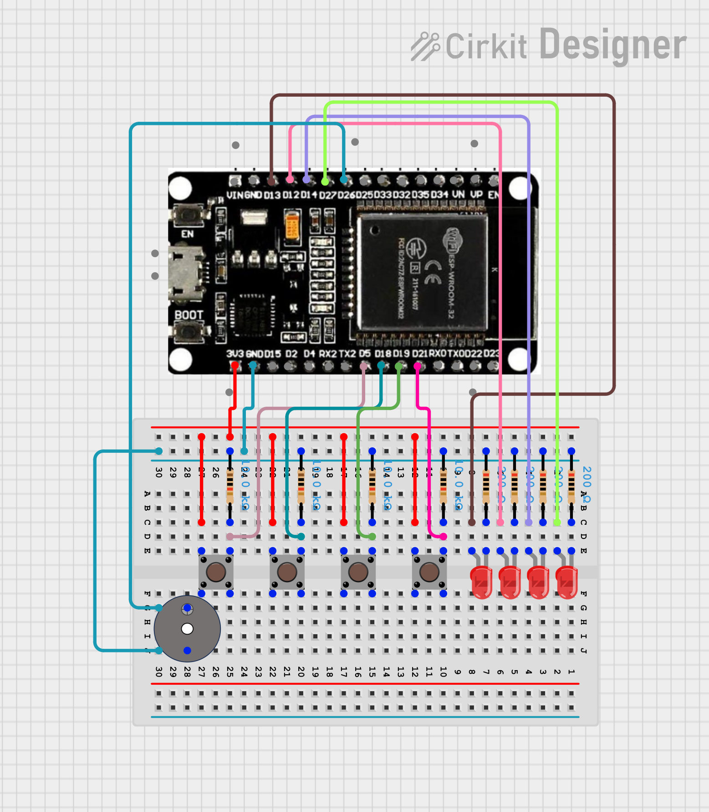

# #25 Simon Says 2

Memory game using **ESP32**, four **push buttons**, four **LEDs**, and a **buzzer**.
The device plays a random light sequence, and the player must reproduce it by pressing the correct buttons in the same order. Each successful round adds more steps to the pattern and speeds up playback.

## Features

- Random LED pattern generation
- Interrupt-driven button handling with debouncing
- Non-blocking pattern display using `millis()`-based state machine
- Buzzer feedback on error
- Level progression with increasing pattern length and speed
- FreeRTOS critical section protection for ISR/main loop communication

## How It Works

The game runs through three phases:

1. **Show Pattern** — LEDs blink in a random sequence; each level adds two more steps
2. **User Input** — the player reproduces the sequence by pressing the matching buttons
3. **Result** — correct sequence advances to the next level; wrong input resets to level 1

Example level progression:

```
Level 1 → 2 steps to remember
Level 2 → 4 steps to remember
Level 3 → 6 steps to remember
...
Level 10 → 20 steps (MAX_PATTERN_SIZE)
```

## State Machine

The program is built around three states defined as an `enum class`:

```
SHOW_PATTERN → USER_INPUT → RESULT → (next level or restart)
```

| State          | Description                                              |
| -------------- | -------------------------------------------------------- |
| `SHOW_PATTERN` | LEDs blink the pattern the player must reproduce         |
| `USER_INPUT`   | Button presses are captured and compared to the pattern  |
| `RESULT`       | Win advances the level; loss resets to level 1 with beep |

## Pattern Speed

Pattern display speed scales with level. The gap between LED flashes shrinks as the level increases:

```
offDuration = max(200ms, 1200ms - level × 100ms)
```

| Level | Off Duration |
| ----- | ------------ |
| 1     | 1100 ms      |
| 5     | 700 ms       |
| 10+   | 200 ms       |

## Interrupt Handling

Button presses are handled via hardware interrupts on each GPIO pin. A 200 ms software debounce prevents multiple triggers per press. The `clicked` flag is protected by a FreeRTOS critical section (`portENTER_CRITICAL_ISR`) to safely share state between the ISR and the main loop.

```cpp
void IRAM_ATTR isr(void *arg) {
  // debounce + critical section
}
```

`IRAM_ATTR` ensures the ISR resides in fast IRAM rather than slower Flash — required for reliable interrupt response on ESP32.

The helper `consumeClick()` atomically reads and clears the `clicked` flag from the main loop context.

## Circuit Image



## Hardware Requirements

Required components:

- ESP32 DevKit
- 4× push buttons
- 4× LEDs + resistors (220Ω recommended)
- Passive buzzer

## Pin Configuration

| Component | ESP32 Pin |
| --------- | --------- |
| Button 1  | GPIO 5    |
| Button 2  | GPIO 18   |
| Button 3  | GPIO 19   |
| Button 4  | GPIO 21   |
| LED 1     | GPIO 13   |
| LED 2     | GPIO 12   |
| LED 3     | GPIO 14   |
| LED 4     | GPIO 27   |
| Buzzer    | GPIO 26   |

## Configuration

All tunable parameters are defined as macros at the top of the file:

| Macro              | Default | Description                       |
| ------------------ | ------- | --------------------------------- |
| `NUM_BUTTONS`      | 4       | Number of buttons and LEDs        |
| `MAX_PATTERN_SIZE` | 20      | Maximum pattern length (level 10) |
| `BUTTON_1_PIN`     | 5       | GPIO pin for button 1             |
| `BUTTON_2_PIN`     | 18      | GPIO pin for button 2             |
| `BUTTON_3_PIN`     | 19      | GPIO pin for button 3             |
| `BUTTON_4_PIN`     | 21      | GPIO pin for button 4             |
| `LED_1_PIN`        | 13      | GPIO pin for LED 1                |
| `LED_2_PIN`        | 12      | GPIO pin for LED 2                |
| `LED_3_PIN`        | 14      | GPIO pin for LED 3                |
| `LED_4_PIN`        | 27      | GPIO pin for LED 4                |
| `BUZZER_PIN`       | 26      | GPIO pin for buzzer               |

## Code Structure

| Function              | Description                                                     |
| --------------------- | --------------------------------------------------------------- |
| `isr()`               | Interrupt handler — debounce + sets `clicked` flag              |
| `consumeClick()`      | Atomically reads and clears the `clicked` flag                  |
| `beep()`              | Plays a tone on the buzzer for a given frequency and duration   |
| `playError()`         | Plays a two-tone error sound on wrong input                     |
| `startGame()`         | Initializes game state, generates new pattern, starts animation |
| `handleShowPattern()` | Blinks the LED pattern non-blockingly using `millis()`          |
| `handleUserInput()`   | Reads button clicks and validates them against the pattern      |
| `handleResult()`      | Advances to next level on win, resets to level 1 on loss        |

## Data Structures

### `Button`

Holds per-button state for interrupt-safe click detection.

| Field           | Type            | Description                          |
| --------------- | --------------- | ------------------------------------ |
| `pin`           | `uint8_t`       | GPIO pin number                      |
| `clicked`       | `volatile bool` | Set by ISR on press                  |
| `lastInterrupt` | `unsigned long` | Timestamp of last interrupt (millis) |
| `mux`           | `portMUX_TYPE`  | FreeRTOS mutex for critical sections |

### `GameData`

Holds all runtime game state.

| Field           | Type      | Description                          |
| --------------- | --------- | ------------------------------------ |
| `pattern[]`     | `uint8_t` | Sequence of LED indices (0–3)        |
| `level`         | `uint8_t` | Current level                        |
| `step`          | `uint8_t` | Current position in the pattern      |
| `patternLength` | `uint8_t` | Total pattern length (`level × 2`)   |
| `win`           | `bool`    | Whether the player is still on track |

## Dependencies

- Arduino ESP32 core (`arduino-esp32`)
- No external libraries required
